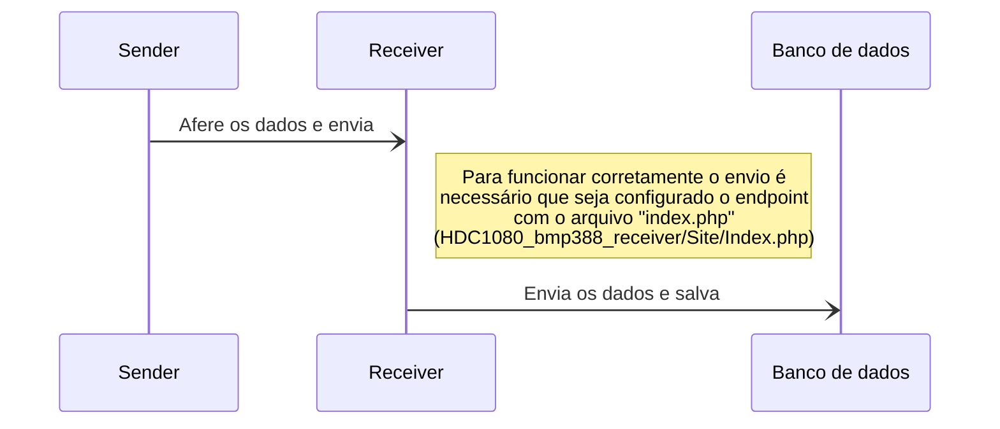

# Mini Estação Meteorológica

Olá! Aqui estão os códigos referentes ao desenvolvimento da mini estação meteorológica com comunicação via tecnologia sem fio de longo alcance para uso na agricultura de precisão.

# Arquivos

• **OLED_LoRa_Receiver**
Arquivos para os testes iniciais da comunicação LoRa.
Utilizados na placa que vai receber os dados enviados pela placa <i>sender</i>.

---
• **OLED_LoRa_Sender**
Arquivos para os testes iniciais da comunicação LoRa.
Utilizados na placa que vai enviar os dados para a placa <i>receiver</i>.

---
• **HDC1080_bmp388_receiver**
Arquivos utilizados no projeto da mini estação meteorológica, já montada.
Utilizados na placa que vai receber os dados enviados pela placa <i>sender</i>.
Possui um arquivo para montar o <i>endpoint</i> que vai receber os dados e envia-los para o banco de dados.

---
• **HDC1080_bmp388_sender**
Arquivos utilizados no projeto da mini estação meteorológica, já montada.
Utilizados na placa que vai enviar os dados para a placa <i>receiver</i>.

---

# Diagrama da comunicação LoRa dentro do projeto
> **Nota:** Arquivos **HDC1080_bmp388_receiver** e **HDC1080_bmp388_sender**.

